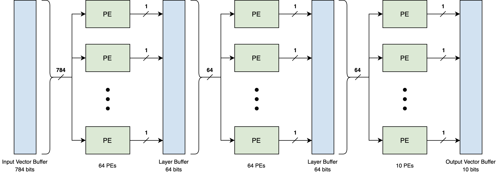

# FINN SEU Simulation

This project implements a software simulation of an FPGA binary neural network (BNN). The network is designed based on the FINNs framework from the paper [FINN: A Framework for Fast, Scalable Binarized Neural Network Inference](https://dl.acm.org/doi/abs/10.1145/3020078.3021744). This particular network classifies handwritten digits from the MNIST dataset.

The project includes numerous tests which were used to meet the first three objectives of the thesis:

1. Construct a model which approximates the behaviour of an FPGA-based neural network
2. Simulate the effects of single event upsets on the model
3. Assess the impact of upsets on the functionality of the model

To provide context, the abstract for the thesis is provided below:

*"Numerous methods have been developed for providing fault tolerance and error recovery for systems deployed on CubeSat FPGAs. Unfortunately, current methods require significant area and power to be implemented, making them incompatible for use with large systems, particularly neural networks which have been recognised as being a major component of future satellite applications. This thesis aimed to determined the impact of upsets on the reliability of FPGA-based neural networks through the use of software models and upset simulations. Based on this, the report compares the suitability of existing and new fault tolerance methods in terms of various metrics. From this analysis, the report concluded that for most applications, a solution using periodic scrubbing and triplication of the output layer provides close to full triplication reliability without a significant increase in area. This work brings us closer to opening further possibilities for CubeSat autonomy, image processing, and data selection."*

Here is an example BNN designed using the FINNs framework:



## Getting Started

The project dependencies you'll need to install:

* Python 2.7
* Numpy

### Installing Dependencies

Installing NumPy

```
$ pip install numpy
```

## Running Files

Note: `hidden_layer_size` refers to the number of nodes in each hidden layer of the network. A network with layer sizes of 784, 64, 64, and 10 will have a hidden layer size of 64.

### Obtaining Trained Weights and Parameters

This project does not include a way to train a network. Fortunately, the network structure used is identical to that used in the [BNN-PYNQ](https://github.com/Xilinx/BNN-PYNQ) project from Xilinx. In particular, the [src/training](https://github.com/Xilinx/BNN-PYNQ/tree/master/bnn/src/training) directory of the project provides detailed instructions on how to train a network. The file you are looking for will resemble something like "mnist_1w_1a.npz". Once obtaining this file, be sure to place it in the params directory.

For your convenience, two of these files are already provided in this project. These are for networks with two hidden layers of 64 or 128 nodes.

### Converting Trained Weights and Parameters to Project Compatible Files

The files obtained from the previous section must be converted and pickled so that they can be quickly be loaded by other scripts. This can be done using the `convert_params.py` file used in the following way:

```
python convert_params.py <hidden_layer_size> <parameter_file>
```

This will place a pickled numpy array containing the trained weights in the weights directory and a pickled numpy array containing the corresponding MVTU thresholds in the thresholds directory.

### Measuring the Accuracy of Networks

The accuracy of a network can be found by running `accuracy.py`:

```
Usage: python accuracy.py <hidden_layer_size>
```

### Performing Weight SEU Accumulation Test

The script `weight_seu_accum_test.py` performs a test in which a set number of SEUs are simulated on a network, with the resulting classification accuracy logged after each SEU. This test is then repeated a set number of times with each test being stored in the results/weight_seu directory. Ten 1000 SEU tests using a network with hidden layer size of 64 is already provided.

```
python weight_seu_accum_test.py <hidden_layer_size> <num_seus> <num_tests>
```

The mean accuracy across tests can be found by running the `weight_seu_accum_test_analysis.py` script. The result is stored in mean_log.txt.

### Performing Node SEU Test

*Instructions Coming Soon*

### Performing Last Layer SEU Test

*Instructions Coming Soon*
